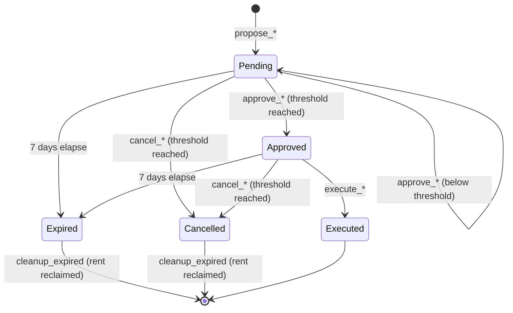
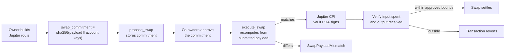
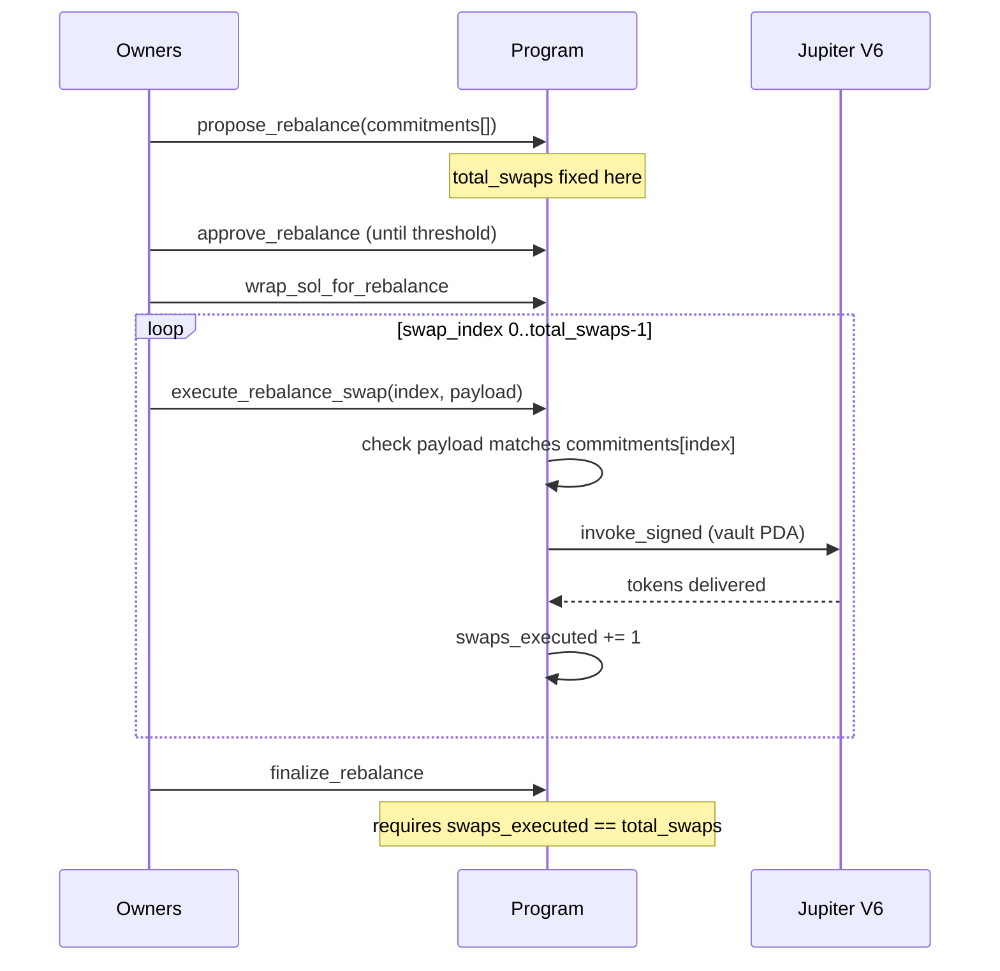
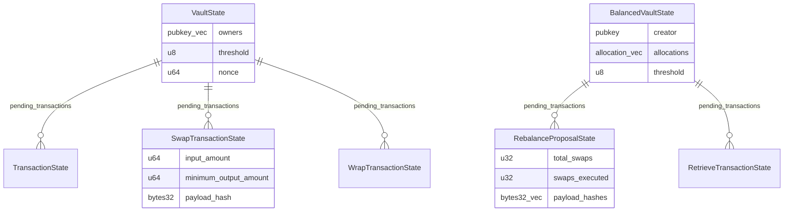

# Sentel Contract

Anchor program behind the Sentel protocol on Solana. It provides two vault types, both
governed by m-of-n owner approval:

- **Standard vault** holds SOL and SPL tokens and releases them only after a threshold of
  owners approves the specific transfer.
- **Balanced vault** holds a portfolio at target allocations in basis points and rebalances
  through Jupiter V6.

## Deployment

| Network      | Program ID                                     |
| ------------ | ---------------------------------------------- |
| Mainnet-beta | `Engn3cBYZPvP37myVuiwanqhs2omZxWRS7twNRJX8uZV` |

No third-party audit has been carried out. See [SECURITY.md](SECURITY.md) before relying on
this program with funds.

## Lifecycle

Every action that moves value follows the same path. Nothing executes without a threshold
of owners approving it first, and a threshold of owners can stop it before it runs.



Cancellation is itself a threshold vote, so one owner cannot unilaterally block the others.
Proposals expire after 7 days, and expired proposals can be cleaned up to recover rent.

## Security model

The multisig is only meaningful if what executes is what the owners approved. Two properties
enforce that.

**Approvals name their destination.** A transfer proposal stores the target, and execution
checks both the SOL recipient and the destination token account against it. The account that
receives the funds is fixed at propose time, not chosen by whoever submits the execution.

**Approvals commit to their route.** Jupiter is called with a payload and account list
supplied by the caller, which would otherwise let an executor substitute a different route or
a destination they control. Every swap proposal therefore stores a SHA-256 commitment over
the exact payload and its ordered account keys. Execution recomputes it and rejects anything
that does not match.



On top of the commitment, `execute_swap` snapshots the vault's input and output token
balances around the CPI and requires that no more input was spent than approved and at least
`minimum_output_amount` was received. The route is bound by hash and the outcome is bound by
measurement.

Every Jupiter CPI is reachable only through an approved proposal. There is no path that lets
a single owner make the vault PDA sign an arbitrary instruction.

## Balanced vault rebalance

Rebalances run as a sequence because a portfolio of swaps rarely fits in one transaction.



Swaps execute in order. `swap_index` must equal the proposal's `swaps_executed`, which keeps
each payload aligned with the commitment it was approved against. `execute_rebalance` runs
the whole sequence in one transaction where it fits.

## Protocol fee

Collected on execution and paid to a hard-coded recipient.

```
Fee     = amount * 0.05%   (5 basis points)
Floor   = 0.005 SOL
Ceiling = 0.2 SOL
```

SPL token transfers pay a flat floor fee. Native SOL transfers are proportional with no
floor. Retrievals cap the fee at the amount being withdrawn, so a small balance can always be
withdrawn rather than being locked by a fee it cannot cover.

## Instructions

### Standard vault

| Instruction              | Description                                                                     |
| ------------------------ | ------------------------------------------------------------------------------- |
| `create_vault`           | Create a vault with owners and an m-of-n threshold.                             |
| `propose_transaction`    | Propose a SOL or SPL token transfer.                                            |
| `approve_transaction`    | Vote to approve a pending transfer.                                             |
| `execute_transaction`    | Execute once the threshold is met.                                              |
| `cancel_transaction`     | Vote to cancel. Removed from pending at threshold.                              |
| `cleanup_expired`        | Reclaim rent from a proposal past its 7 day expiry.                             |
| `close_vault`            | Close an empty vault. Requires no pending proposals and a balance under 0.3 SOL.|
| `get_vault_info`         | Emit `VaultInfoEvent` with current vault state.                                 |
| `get_transaction_status` | Emit `TransactionStatusEvent` with the current approval count.                  |
| `propose_swap`           | Propose an SPL-to-SPL Jupiter swap, committing to the route.                    |
| `propose_sol_swap`       | Propose a SOL-to-token swap. SOL is wrapped to WSOL at propose time.            |
| `approve_swap`           | Vote to approve a pending swap.                                                 |
| `execute_swap`           | Execute the committed route and verify the resulting balances.                  |
| `cancel_swap`            | Vote to cancel a pending swap.                                                  |
| `propose_wrap`           | Propose wrapping SOL to WSOL.                                                   |
| `approve_wrap`           | Vote to approve a pending wrap.                                                 |
| `execute_wrap`           | Move SOL into the vault WSOL ATA and collect the fee.                           |
| `cancel_wrap`            | Vote to cancel a pending wrap.                                                  |

### Balanced vault

| Instruction                    | Description                                                              |
| ------------------------------ | ------------------------------------------------------------------------ |
| `open_balanced_vault`          | Create a balanced vault with up to 10 allocations summing to 100%.       |
| `close_balanced_vault`         | Close the vault and return rent.                                         |
| `update_allocations`           | Update target allocations. Blocked while a proposal is pending.          |
| `wrap_sol_for_rebalance`       | Wrap vault SOL to WSOL ahead of a rebalance. Charges the fee.            |
| `unwrap_wsol_for_rebalance`    | Unwrap vault WSOL back to SOL.                                           |
| `propose_rebalance`            | Open a rebalance proposal committing to one route per swap.              |
| `approve_rebalance`            | Vote to approve a pending rebalance.                                     |
| `cancel_rebalance`             | Vote to cancel a pending rebalance.                                      |
| `execute_rebalance`            | Run every committed swap in a single transaction, then close the PDA.    |
| `execute_rebalance_swap`       | Run one committed swap. Leaves the PDA open.                             |
| `finalize_rebalance`           | Close the proposal once every committed swap has run.                    |
| `propose_retrieve_transaction` | Propose a full withdrawal, committing to the liquidation routes.         |
| `approve_retrieve_transaction` | Vote to approve a pending withdrawal.                                    |
| `cancel_retrieve_transaction`  | Vote to cancel a pending withdrawal.                                     |
| `execute_retrieve_transaction` | Liquidate to SOL and pay the recipient.                                  |
| `close_zombie_retrieve`        | Reclaim rent from an executed retrieve PDA that was never closed.        |

## Accounts



PDA seeds:

| Account                   | Seeds                                                        |
| ------------------------- | ------------------------------------------------------------ |
| `VaultState`              | `"vault"`, creator, vault_id                                 |
| `TransactionState`        | `"transaction"`, vault, nonce                                |
| `SwapTransactionState`    | `"swap"`, vault, nonce                                       |
| `BalancedVaultState`      | `"balanced_vault"`, creator, vault_id                        |
| `RebalanceProposalState`  | `"rebalance_proposal"`, creator, vault_id, nonce             |
| `RetrieveTransactionState`| `"retrieve_transaction"`, creator, vault_id, nonce           |

## Build and test

Requires Rust 1.89.0, Solana CLI 2.1, Anchor 0.32.1 and Yarn.

```bash
yarn install
anchor build
anchor test
```

`anchor test` starts a local validator. Jupiter is not deployed there, so tests covering swap
execution assert that the program reaches the CPI boundary with the right state rather than
that a swap settles.

Computing a commitment client-side, matching `commitment::swap_commitment`:

```ts
import { createHash } from "crypto";

const hash = createHash("sha256");
hash.update(jupiterInstructionData);
for (const key of accountKeys) hash.update(key.toBuffer());
const commitment = Array.from(hash.digest());
```

The account keys must be passed in the same order they are supplied as remaining accounts at
execution time.

## Licence

[MIT](LICENSE)
